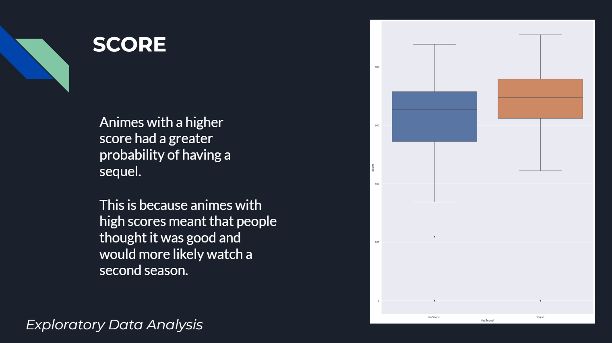
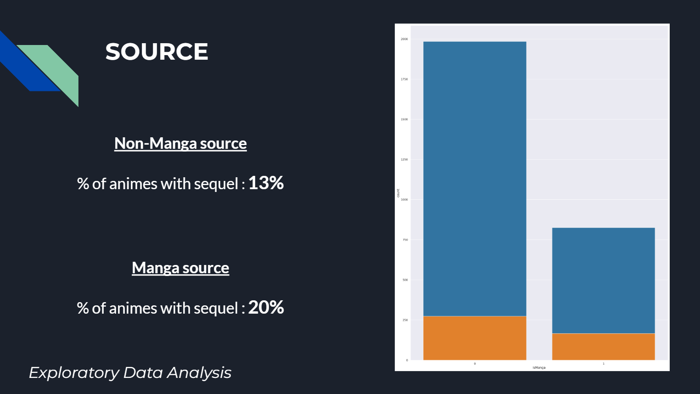
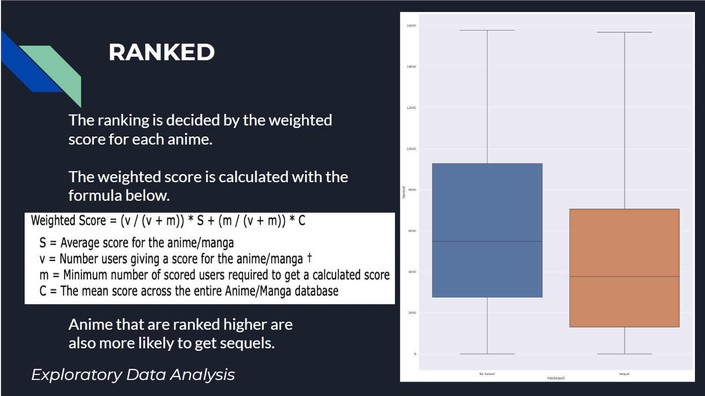
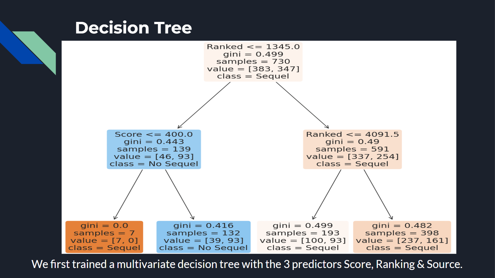
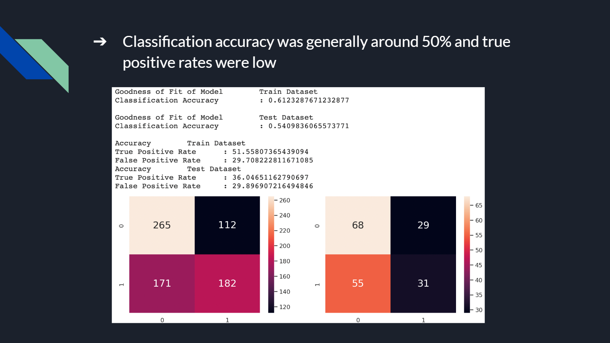
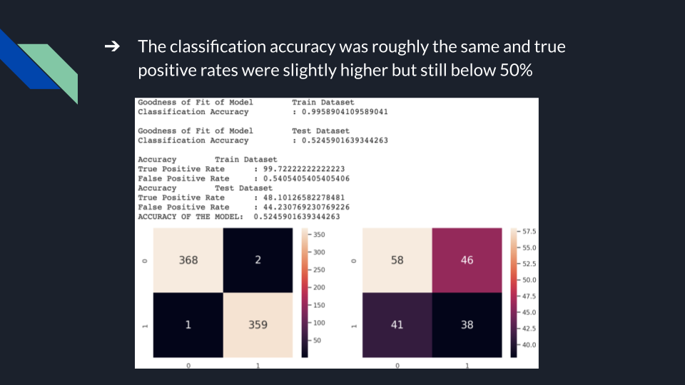
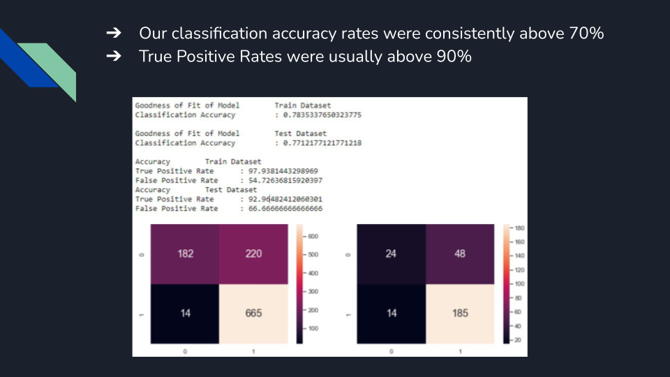
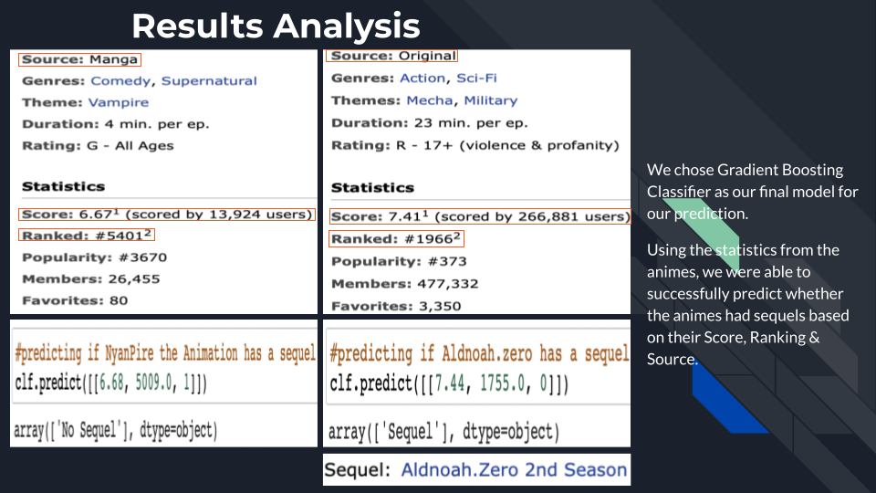
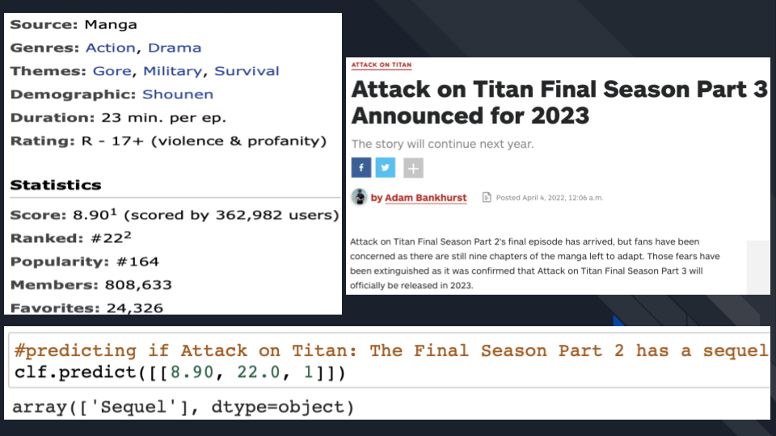


# Welcome to Anime Season 2 Predictor repository

## About
Welcome to our Mini-Project for SC1015 (Introduction to Data Science and Artificial Intelligence) which focuses on anime data from the Kaggle dataset [Anime Recommendation Database 2020](https://www.kaggle.com/datasets/hernan4444/anime-recommendation-database-2020). 

For detailed walkthrough, please view the source code in order from:

1. [Data Extraction](https://github.com/arun016/AnimeSeason2Predictor/blob/main/DataExtractionAndCleanup.ipynb)

2. [Data Visualization](https://github.com/arun016/AnimeSeason2Predictor/blob/main/DataVisualizationEDA.ipynb)

3. [Decision Tree Classifier](https://github.com/arun016/AnimeSeason2Predictor/blob/main/DecisionTree.ipynb)

4. [Random Forest Classifier](https://github.com/arun016/AnimeSeason2Predictor/blob/main/RandomForest.ipynb)

5. [Gradient Boosting Classifier](https://github.com/arun016/AnimeSeason2Predictor/blob/main/GradientBoostingClassifier.ipynb)

##  Problem Definition

#####  What is the probability of an anime getting a Season 2?

#####  An anime getting a season 2 has an impact on multiple demographics. It not only impacts the consumer, but also the content creators and the merchandise producers.

#####  Being able to accurately predict if an anime will get a second season will help people better prepare themselves for when season 2 drops:

- Consumers -- Deal with anxiety and frustration of not knowing whether there will be a season 2, decide whether to read source materials
- Online Content Creators -- Produce content by providing news updates/rumors
- Merchandise Producers -- Able to make an informed decision on whether to produce merchandise for the anime

##  Choosing our Dataset

After browsing many datasets on Kaggle, our team decided that the Anime Recommendation Dataset was the most useful one. It was up-to-date and had many upvotes. It included 17558 rows of up-to-date Anime data with potentially useful columns such as Genres, Scores, Ranked, Popularity, Members etc. The data included in this dataset was based on the popular Anime Community website, [MyAnimeList]([MyAnimeList.net](https://myanimelist.net/)).

##  Data Cleanup

However, the dataset was not perfect. It had too many columns and also no way to tell whether an anime had a sequel as there was no relationship between any data entry. Thus, we needed to comb through each value and find sequels to include a relationship variable between them. (HasSequel and SequelName). This can be found in our Data Cleanup File.

---

##  EDA

We explored the numerical and categorical columns in our dataset, namely:
 
- Score

- Ranked

- Source

We found that anime with sequels had better scores,  tend to rank higher and that there was a higher percentage of anime with sequels that came from Manga than any other medium.

##  Models Used

1. Decision Tree Classifier

2. Random Forest Classifier

### Random Forest is a collection of decision trees with a single, aggregated result

 Markup : 1. A numbered list
              1. A nested numbered list
              2. Which is numbered
          2. Which is numbered
          
          

### 3. Gradient Boosting Classifier
Gives a prediction model in the form of an ensemble of weak prediction models, which are typically decision trees. 
When a decision tree is the weak learner, the resulting algorithm is called gradient-boosted trees; it usually outperforms random forest.

##  Conclusion

We were able to accurately predict whether an anime will have a sequel with the variables Score, Ranked and Source. Our accuracy rate was consistently above 70% when provided with these values but only when using the Gradient Boosting Classifer with sampled data. Sampling the data was a very important step in our project as without it, we were having poor accuracy results, consistently between the 30~50% range.

-   We were able to achieve a high prediction accuracy of 77% of the GBC model
    
-   Using Gradient Boosting Classifier, we could give a convincing prediction of whether an anime will get a sequel based on 3 variables alone
    
-   Good indicator for users to know if an anime will have a sequel to appease them

-   Our model only considered 3 factors. In most cases, there are more factors that are considered when making another season to an anime, such as production cost, availability of resources etc.

##  What did we learn from this project?

- Random Forest, an improved version of decision trees, making use of a collection of trees

- Gradient Boosting Classifier, better performing decision tree algorithm compared to Random Forest

##  Contributors

- Adam Tan : Motivation/Problem Statement, Data Extraction & Curation, Video Narrator
- Arun Ezekiel : Exploratory Data Analysis/Visualisation, Data Preparation & Cleaning, Video Editor
- Lim Shi Bin : Machine Learning, Video Narrator
(Contributions include respective slides, script and code where applicable)

## References

[https://www.grandviewresearch.com/industry-analysis/anime-market](https://www.grandviewresearch.com/industry-analysis/anime-market "https://www.grandviewresearch.com/industry-analysis/anime-market")  
[https://www.kaggle.com/datasets/hernan4444/anime-recommendation-database-2020](https://www.kaggle.com/datasets/hernan4444/anime-recommendation-database-2020 "https://www.kaggle.com/datasets/hernan4444/anime-recommendation-database-2020")  
[https://www.mastersindatascience.org/learning/statistics-data-science/undersampling/](https://www.mastersindatascience.org/learning/statistics-data-science/undersampling/ "https://www.mastersindatascience.org/learning/statistics-data-science/undersampling/")  
[https://www.cbr.com/why-anime-seasons-take-so-long/](https://www.cbr.com/why-anime-seasons-take-so-long/ "https://www.cbr.com/why-anime-seasons-take-so-long/")  
[https://www.datasciencecentral.com/decision-tree-vs-random-forest-vs-boosted-trees-explained/](https://www.datasciencecentral.com/decision-tree-vs-random-forest-vs-boosted-trees-explained/ "https://www.datasciencecentral.com/decision-tree-vs-random-forest-vs-boosted-trees-explained/")  
[https://www.educba.com/random-forest-vs-gradient-boosting/](https://www.educba.com/random-forest-vs-gradient-boosting/ "https://www.educba.com/random-forest-vs-gradient-boosting/")  
[https://leonlok.co.uk/blog/decision-trees-random-forests-gradient-boosting-whats-the-difference/](https://leonlok.co.uk/blog/decision-trees-random-forests-gradient-boosting-whats-the-difference/ "https://leonlok.co.uk/blog/decision-trees-random-forests-gradient-boosting-whats-the-difference/")  
[https://www.analyticsvidhya.com/blog/2021/06/understanding-random-forest/](https://www.analyticsvidhya.com/blog/2021/06/understanding-random-forest/ "https://www.analyticsvidhya.com/blog/2021/06/understanding-random-forest/")  
[https://en.wikipedia.org/wiki/Random_forest](https://en.wikipedia.org/wiki/Random_forest "https://en.wikipedia.org/wiki/Random_forest")  
[https://en.wikipedia.org/wiki/Gradient_boosting](https://en.wikipedia.org/wiki/Gradient_boosting "https://en.wikipedia.org/wiki/Gradient_boosting")
[https://seaborn.pydata.org/api.html](https://seaborn.pydata.org/api.html "https://seaborn.pydata.org/api.html")
[https://pandas.pydata.org/docs/reference/index.html](https://pandas.pydata.org/docs/reference/index.html "https://pandas.pydata.org/docs/reference/index.html")
[https://www.geeksforgeeks.org/random-forest-classifier-using-scikit-learn/](https://www.geeksforgeeks.org/random-forest-classifier-using-scikit-learn/ "https://www.geeksforgeeks.org/random-forest-classifier-using-scikit-learn/")
[https://stackabuse.com/gradient-boosting-classifiers-in-python-with-scikit-learn/](https://stackabuse.com/gradient-boosting-classifiers-in-python-with-scikit-learn/ "https://stackabuse.com/gradient-boosting-classifiers-in-python-with-scikit-learn/")
